# Linux Documentation

For my linux practice i have downlaoded the **Oracle virtual machine virtual box manager** and used ubunto image version 24.04, plus i already had an ubunto version 22.04.4  which i used as a windows subsystem linux(WSL) which i can interact with the linux enviroment just by using the ubunto terminal.  

For the task i will be using the virtual machine version.

---
---

## the Documentation

- After downloading the Oracle virtual machine virtual box manager and creating a new virtual machine with the ubunto image version 24.04, and opening the new virtual machine i get the following linux desktop homescreen.
---
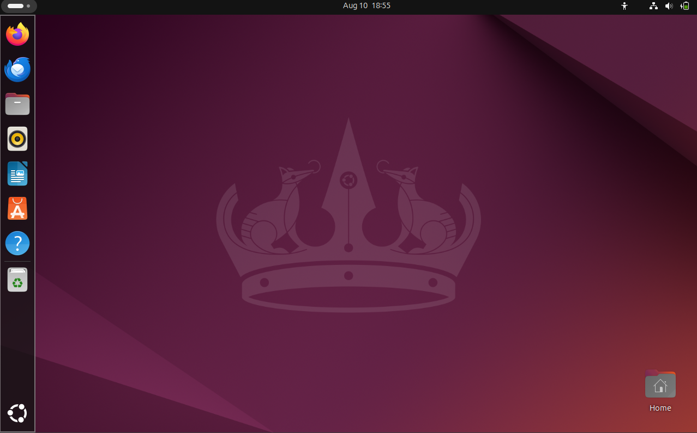
---

- we will first open the terminal and try the **ls command**
---
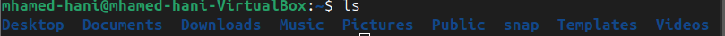
---

- the ls command shows all the files and folders in my current working directory   
Now to get the current working directory we will use the **pwd command**  
---
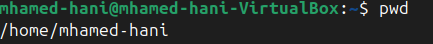
---

- As we can see our working directory is in the home folder inside my username mhamed-hani if i went to this directory through my linux desktop we will find the following folder 
---
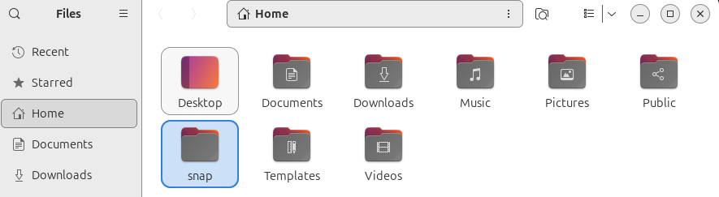
---

- which we can see the same list of items as the ones that were listed using the ls command  
Now i will navigate to the Documents folder using the following command.
> cd Documents 

- Then i will make a new folder directory named **testing_folder** using the command
> mkdir testing_folder
---
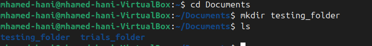  
---

- When i typed ls to make sure the folder was created found the **testing_folder** folder , i also found the **trial_folder** that i created earlier now we will delete it using the **rm -r trial_folder** this removes the - - folder and all its ocntents recursively.
---
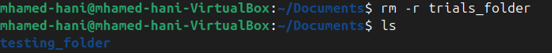  
---

- we can see that the folder was compeletly deleted.  
I will navigate to the testing_folder we created and make a new text file then i will open the text file using the nano editor and type some few lines
---
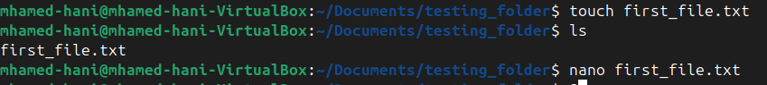  
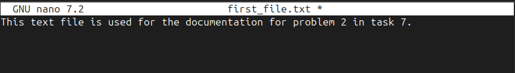
---

now i will use the **cp command** to make a copy of the text file we just created in the same directory

---
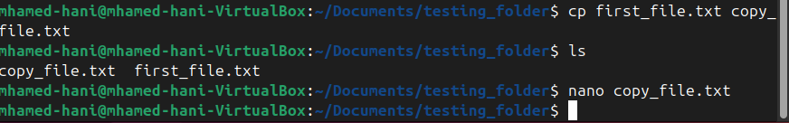
---

- When I open the the copied file using the nano editor i can see the content of the original file copied in the the copy_file  

- I used the command   
> man mv  
- to get the manual of how i can use the **mv command**  
I found that i can use the mv command to move a file in my current directory to another directory and it can also be used to rename a file

- Then i made a new directory called **subfolder** and moved the copy_file using the command
> mv  
---
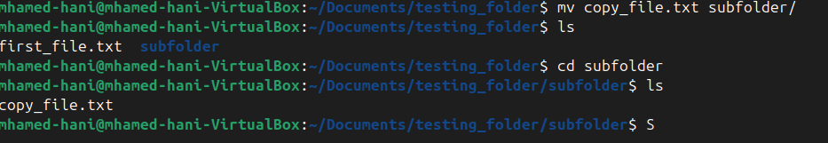
---
- now using the same **mv command** i will change the name of that file
---
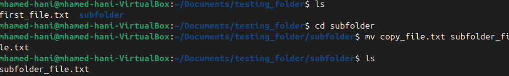
---

- Now i will see the manual for the **cat command** and use it on the subfolder file
---

---

-As you can see the **cat command** can be used to print out the contents of the file i also gave it the **-n** flag so it can enuemrate the lines in the file

- I will try adding some lines to the subfolder file using the nano editor to make sure the -n is working correctly  
---
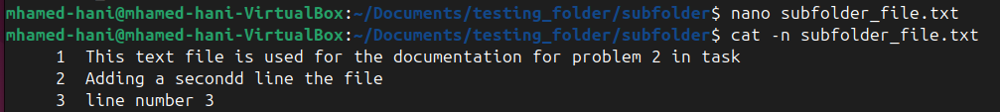
---

- So as we can see it prints out all the lines in the file with correct numbering
 
- Now i can try to access that file through my linux enviroment GUI to make sure i'm doing everything correctly
---
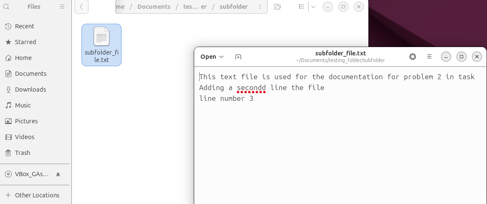
---
Everything was done correctly

- I will try to search for the first_file we created in the Documents directory earlier using the **find command** which can be used to search for files and folders.

---
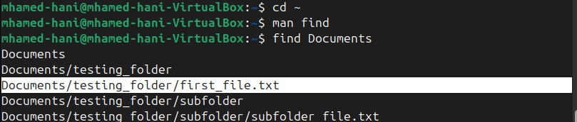
---

- I can also make a message pop up by editting the .bashrc in the home directory by adding at the end of the file:
> echo "the message i want to add"
---
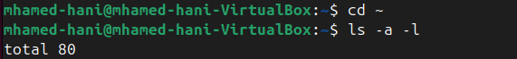
---
- I then used the **source command** to apply the changes made to the file
---
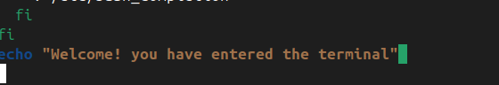
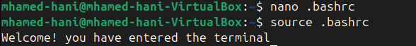
---
- Now i will try to open the termnial
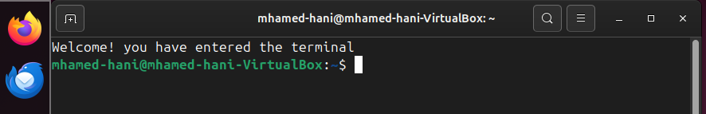
we can see the message we typed at the end of the file actually appeared

- we can use the **htop command** which works as the task manager in the windows. it lets you navigate through processes, see the cpu and gpu usage of each process and you i can end any task if i want to.
---
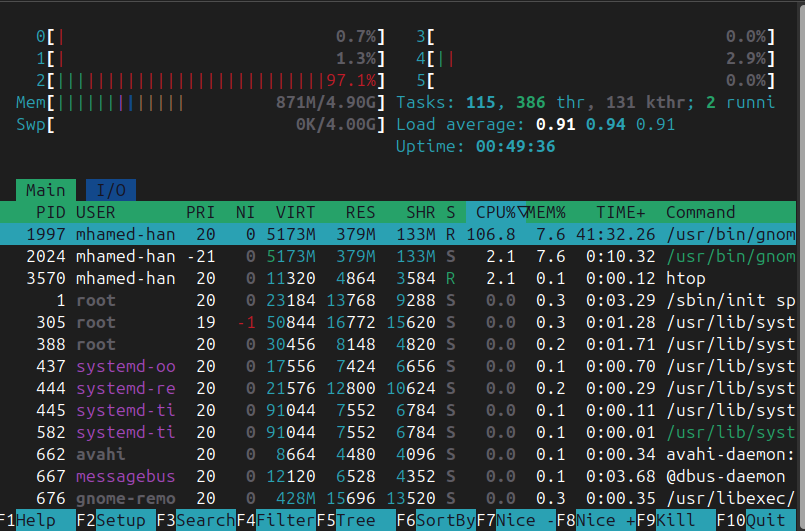
---
this how the terminal will look like after using  **htop**.

- I can also use commands like **df** which displays disk space usage and **free** which shows the memory usage.
---
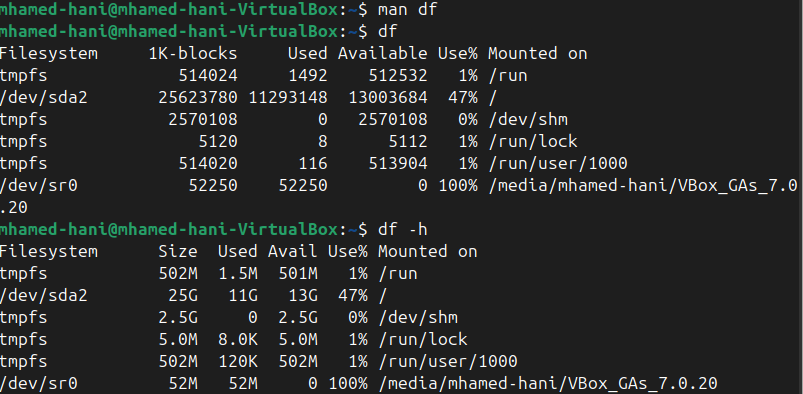
---
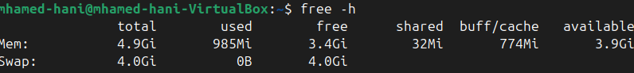
---

I used the -h flag to chnage it into a human readable form which is basically a more understandable layout.

- The last command i am going to try will be the **alias** which creates shortcuts for commands

---
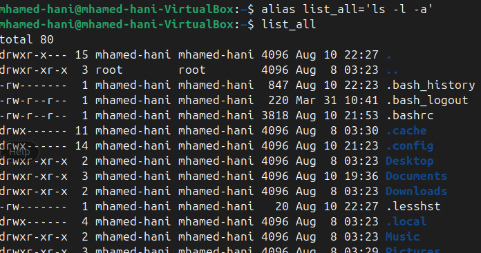
---
here i have used the alias command so i can call **list_all** at any time which will list all the files and folder in my directories in a list form including the hidden files